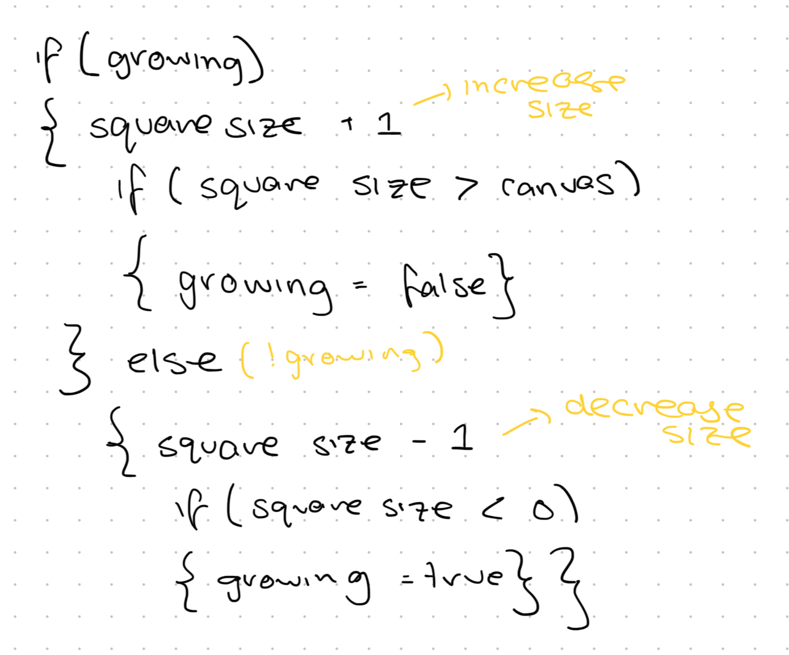
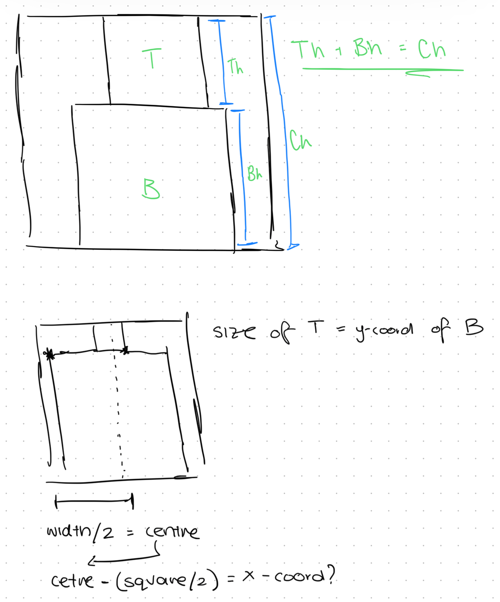

# Rafaël Rozendaal's Blocks: What's under the hood?

## Attempt 1

<iframe id="blocks_1" src="https://editor.p5js.org/lizshw/full/uKWJ-QXJl"></iframe>

This was my first attempt of a simplified version of BLOCKS by Rafael Rozendaal. I wanted to focus on the basic functionality of the artwork, getting two rectangles that would change size depending on each other and in reference to the canvas size.

I used a boolean variable to control the animation's direction; whether the rectangles were growing or shrinking. I then had a if/else statement control the rectangles themselves. I realised that with the way the code is now, the rectanlges (or squares as they should be), are being drawn from the top left corner, but should be drawn from the center. "rectMode(CENTER)" changes where they are drawn from, but the code I have written relies on the square being from the top left corner.
</script>

## Attempt 2

<iframe id="block_2" src="https://editor.p5js.org/lizshw/full/zFjqxBzza"></iframe>

In this version, I focused on changing where the square was being drawn from, particularly the x-coordinate. I figured it would be easier (keeping my code the same and y-coord) if I were to keep rectMode(CORNER) rather than change it to CENTER. Instead, I messed around with values, essentially calculating it so that the top square and bottom square x-coord is equal to half of the width of the canvas. I also changed how the y-coord (being drawn) of the bottom square to be the height of the top square, and the size being the inverse of each other (width of canvas - top square).

</script>
